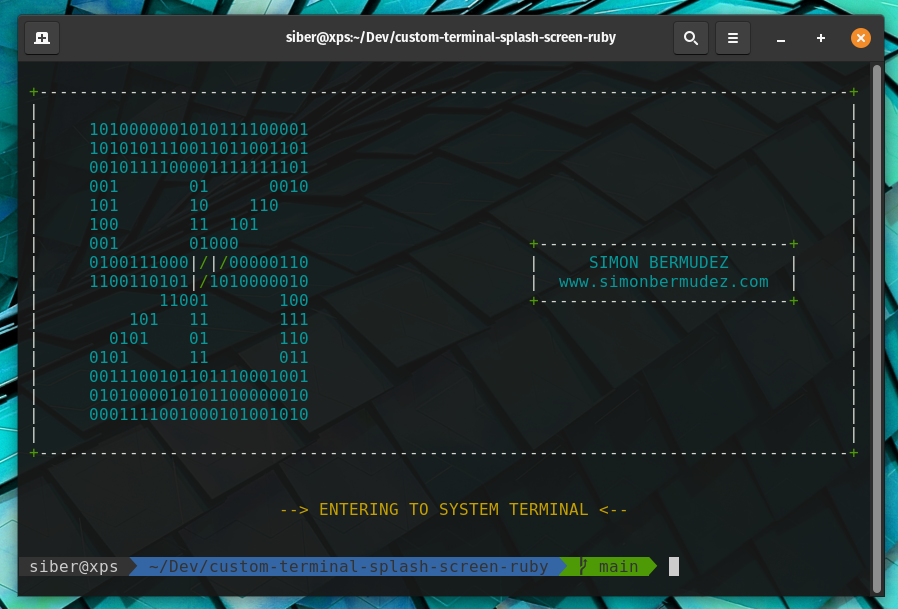

# custom-terminal-splash-screen-ruby
Responsive Ruby Splash Screen of my terminal written in Ruby

# How to run

1) First make sure you have Ruby installed, if you don't have it, run `sudo apt install ruby-full`
2) Install the following Dependences `sudo gem install colorize tty-screen`
3) `ruby splash.rb`

 # Edit it, add your name and logo

 You can edit and add your name and logo just editing the splash string. 